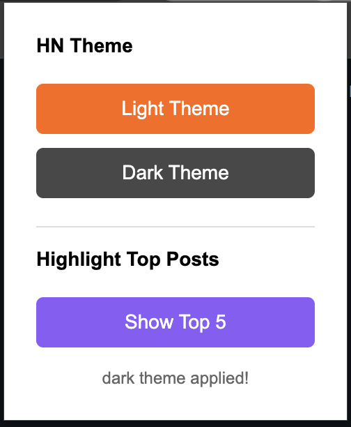

# Hacker News AI tools

This will be a collection of AI tools for Hacker News in FUTURE.
But it's not future yet, so now you can use it to switch themes and highlight top posts.

## Screenshots

| Extension Popup | Hacker News Dark Mode |
|:---:|:---:|
|  |  |

## Features

- Switch themes
- Highlight top posts

## Installation

1. Create a folder for your extension
2. Save all the files above in that folder
3. Open Chrome and go to `chrome://extensions/`
4. Enable "Developer mode" (top right)
5. Click "Load unpacked" and select your extension folder
6. Visit https://news.ycombinator.com and click the extension icon to switch themes!

The extension saves your preference and automatically applies it when you visit Hacker News.

## Development

1. Modify anything you want
2. Go to `chrome://extensions/` and click on "Reload" button to see your changes